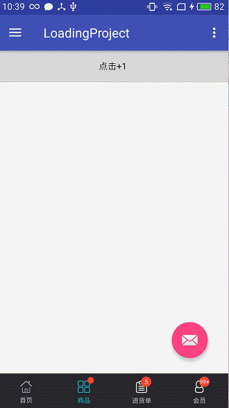

#Android带数字或红点的底部导航拦和联网等待加载动画
### 首先展示一下截图效果

### 一、Android带红点的底部导航拦
#### 1.首先写底部导航栏的界面view_main_tab.xml.
    <?xml version="1.0" encoding="utf-8"?>
    <LinearLayout xmlns:android="http://schemas.android.com/apk/res/android"
    android:id="@+id/tab_layout"
    android:layout_width="match_parent"
    android:layout_height="56dp"
    android:layout_alignParentBottom="true"
    android:orientation="horizontal"
    android:background="#27282c"
    >
    
    <RelativeLayout
    android:id="@+id/rl_1"
    android:layout_width="0dp"
    android:layout_height="match_parent"
    android:layout_marginTop="4dp"
    android:layout_weight="1">
    
    <RadioButton
    android:id="@+id/rb_1"
    android:layout_width="wrap_content"
    android:layout_height="wrap_content"
    android:layout_centerInParent="true"
    android:button="@null"
    android:background="@null"
    android:checked="true"
    android:clickable="false"
    android:drawablePadding="5dp"
    android:drawableTop="@drawable/selector_tab_home"
    android:gravity="center"
    android:text="首页"
    android:textColor="@drawable/tab_text_selector"
    android:textSize="10sp" />
    
    <TextView
    android:id="@+id/tv_1"
    android:layout_width="16dp"
    android:layout_height="16dp"
    android:layout_alignRight="@id/rb_1"
    android:layout_alignTop="@id/rb_1"
    android:layout_marginTop="-6dp"
    android:layout_marginRight="-6dp"
    android:layout_gravity="right"
    android:background="@drawable/msg_num_shape"
    android:clickable="false"
    android:gravity="center"
    android:text="3"
    android:textColor="@color/white_1"
    android:textSize="10sp"
    />
    
    </RelativeLayout>
    
    <RelativeLayout
    android:id="@+id/rl_2"
    android:layout_width="0dp"
    android:layout_height="match_parent"
    android:layout_marginTop="4dp"
    android:layout_weight="1"
    android:focusable="true">
    
    <RadioButton
    android:id="@+id/rb_2"
    android:layout_width="wrap_content"
    android:layout_height="wrap_content"
    android:layout_centerInParent="true"
    android:background="@null"
    android:button="@null"
    android:clickable="false"
    android:drawablePadding="5dp"
    android:drawableTop="@drawable/selector_tab_goods_divide"
    android:gravity="center"
    android:text="商品"
    android:textColor="@drawable/tab_text_selector"
    android:textSize="10sp" />
    
    <TextView
    android:id="@+id/tv_2"
    android:layout_width="16dp"
    android:layout_height="16dp"
    android:layout_alignRight="@id/rb_2"
    android:layout_alignTop="@id/rb_2"
    android:layout_marginTop="-6dp"
    android:layout_marginRight="-6dp"
    android:layout_gravity="right"
    android:background="@drawable/msg_num_shape"
    android:clickable="false"
    android:gravity="center"
    android:text="3"
    android:textColor="@color/white_1"
    android:textSize="10sp"
    />
    </RelativeLayout>
    
    <RelativeLayout
    android:id="@+id/rl_3"
    android:layout_width="0dp"
    android:layout_height="match_parent"
    android:layout_marginTop="4dp"
    android:layout_weight="1">
    
    <RadioButton
    android:id="@+id/rb_3"
    android:layout_width="wrap_content"
    android:layout_height="wrap_content"
    android:layout_centerInParent="true"
    android:background="@null"
    android:button="@null"
    android:clickable="false"
    android:drawablePadding="5dp"
    android:drawableTop="@drawable/selector_tab_stock_list"
    android:gravity="center"
    android:text="进货单"
    android:textColor="@drawable/tab_text_selector"
    android:textSize="10sp" />
    
    <TextView
    android:id="@+id/tv_3"
    android:layout_width="16dp"
    android:layout_height="16dp"
    android:layout_alignRight="@id/rb_3"
    android:layout_alignTop="@id/rb_3"
    android:layout_marginTop="-6dp"
    android:layout_gravity="right"
    android:background="@drawable/msg_num_shape"
    android:clickable="false"
    android:gravity="center"
    android:text="3"
    android:textColor="@color/white_1"
    android:textSize="10sp"
    />
    
    </RelativeLayout>
    
    
    <RelativeLayout
    android:id="@+id/rl_4"
    android:layout_width="0dp"
    android:layout_height="match_parent"
    android:layout_marginTop="4dp"
    android:layout_weight="1">
    
    <RadioButton
    android:id="@+id/rb_4"
    android:layout_width="wrap_content"
    android:layout_height="wrap_content"
    android:layout_centerInParent="true"
    android:background="@null"
    android:button="@null"
    android:clickable="false"
    android:drawablePadding="5dp"
    android:drawableTop="@drawable/selector_tab_member"
    android:gravity="center"
    android:text="会员"
    android:textColor="@drawable/tab_text_selector"
    android:textSize="10sp" />
    
    
    <TextView
    android:id="@+id/tv_4"
    android:layout_width="16dp"
    android:layout_height="16dp"
    android:layout_alignRight="@id/rb_4"
    android:layout_alignTop="@id/rb_4"
    android:layout_marginTop="-6dp"
    android:layout_marginRight="-6dp"
    android:layout_gravity="right"
    android:background="@drawable/msg_num_shape"
    android:clickable="false"
    android:gravity="center"
    android:text="3"
    android:textColor="@color/white_1"
    android:textSize="10sp"
    />
    </RelativeLayout>
    
    </LinearLayout>
#### 2.修改底部导航栏的数字，在MainActivity中

     /**
     * -1:表示没有新消息
     * -2:表示新消息用红点的方式显示
     * 0-99：直接显示数字
     * >=100:用99+显示
     */
    private void messageTips(int num, TextView tv) {
    if(num==-1){
       tv.setVisibility(View.GONE);
    }else if(num==-2){
    tv.setVisibility(View.VISIBLE);
    tv.setText("");
    RelativeLayout.LayoutParams layoutParams = (RelativeLayout.LayoutParams) tv.getLayoutParams();
    layoutParams.height= DensityUtil.dip2px(this,10);
    layoutParams.width= DensityUtil.dip2px(this,10);
    tv.setLayoutParams(layoutParams);
    }else if(num>=0&&num<=99){
    tv.setVisibility(View.VISIBLE);
    tv.setText(num+"");
    RelativeLayout.LayoutParams layoutParams = (RelativeLayout.LayoutParams) tv.getLayoutParams();
    layoutParams.height= DensityUtil.dip2px(this,16);
    layoutParams.width= DensityUtil.dip2px(this,16);
    tv.setLayoutParams(layoutParams);
    }else if(num>=100){
    tv.setVisibility(View.VISIBLE);
    tv.setText("99+");
    RelativeLayout.LayoutParams layoutParams = (RelativeLayout.LayoutParams) tv.getLayoutParams();
    layoutParams.height= DensityUtil.dip2px(this,16);
    layoutParams.width= DensityUtil.dip2px(this,16);
    tv.setTextSize(DensityUtil.sp2px(this,3));
    tv.setLayoutParams(layoutParams);
    }else{
    tv.setVisibility(View.GONE);
    }
    
    }
#### 3.需要在fragment中修改MainActivity中的底部导航拦，所以，要在MainActivity中，写一些公用的方法。
     /**
     * 在oneFragment中更新，底部导航栏的数字
     * @param num
     */
    public void updateOne(int num){
    messageTips(num,tv_1);
    }
    /**
     * 在TwoFragment中更新，底部导航栏的数字
     * @param num
     */
    public void updateTwo(int num){
    messageTips(num,tv_2);
    }
    /**
     * 在ThreeFragment中更新，底部导航栏的数字
     * @param num
     */
    public void updateThree(int num){
    messageTips(num,tv_3);
    }
    /**
     * 在FourFragment中更新，底部导航栏的数字
     * @param num
     */
    public void updateFour(int num){
    messageTips(num,tv_4);
    }
#### 4.在fragment中修改底部导航拦，得到主页面，调用主页面的修改方法。
    mActivity = (MainActivity) getActivity();
    number++;
    mActivity.updateTwo(number);
# 二、activity加载动画。
#### 1.activity中的加载动画，要写一个BaseActivity。布局如下
    <?xml version="1.0" encoding="utf-8"?>
    <LinearLayout xmlns:android="http://schemas.android.com/apk/res/android"
    xmlns:tools="http://schemas.android.com/tools"
    android:id="@+id/activity_base"
    android:layout_width="match_parent"
    android:layout_height="match_parent"
    android:orientation="vertical"
    tools:context="com.hrobbie.loadingproject.activity.BaseActivity">
    
    
    <android.support.v7.widget.Toolbar xmlns:app="http://schemas.android.com/apk/res-auto"
    android:id="@+id/tool_bar"
    android:layout_width="match_parent"
    android:layout_height="?attr/actionBarSize"
    app:contentInsetStart="0.0dp"
    android:background="@color/colorPrimary"
    app:layout_scrollFlags="enterAlways|scroll"
    app:popupTheme="@style/AppTheme.PopupOverlay"
    />
    <FrameLayout
    android:id="@+id/fl_content"
    android:layout_width="match_parent"
    android:layout_height="match_parent">
    <include layout="@layout/loading_anim"/>
    </FrameLayout>
    
    </LinearLayout>
#### 注意：id为fl_content的FrameLayout的布局里，包含了一个loading_anim的布局，这就是加载布局。加载布局，里面氛围三个线性布局，分别是：加载中布局，加载错误布局，没有数据布局，其中加载失败布局，还需要点击重新加载。内容如下：
    <?xml version="1.0" encoding="utf-8"?>
    <FrameLayout
    xmlns:android="http://schemas.android.com/apk/res/android"
    android:layout_width="match_parent"
    android:layout_height="match_parent"
    >
    <!--加载中-->
    <LinearLayout android:id="@+id/ll_loading"
    android:layout_width="match_parent"
    android:layout_height="match_parent"
    android:layout_marginBottom="90dp"
    android:gravity="center"
    android:orientation="vertical"
    >
    
    <ImageView
    android:id="@+id/iv_loading"
    android:layout_width="wrap_content"
    android:layout_height="wrap_content"
    android:src="@drawable/loading_everyday" />
    
    <TextView
    android:layout_width="wrap_content"
    android:layout_height="wrap_content"
    android:layout_marginTop="15dp"
    android:text="正在为您开启干货推荐.."
    android:textColor="@color/colorTitle"
    android:textSize="14sp" />
    
    <TextView
    android:layout_width="wrap_content"
    android:layout_height="wrap_content"
    android:layout_marginTop="7dp"
    android:text="看的越多，推荐越准"
    android:textColor="@color/colorSubtitle"
    android:textSize="12sp"
    android:visibility="visible" />
    
    </LinearLayout>
    
    
    <!--加载失败-->
    <LinearLayout
    android:id="@+id/ll_error_refresh"
    android:layout_width="match_parent"
    android:layout_height="match_parent"
    android:gravity="center"
    android:orientation="vertical"
    android:visibility="gone">
    
    <ImageView
    android:id="@+id/img_err"
    android:layout_width="wrap_content"
    android:layout_height="wrap_content"
    android:src="@drawable/load_err" />
    
    <TextView
    android:layout_width="wrap_content"
    android:layout_height="wrap_content"
    android:layout_marginTop="15dp"
    android:text="加载失败,点击重试"
    android:textSize="15sp" />
    </LinearLayout>
    <!--加载失败-->
    <LinearLayout
    android:id="@+id/ll_no_data"
    android:layout_width="match_parent"
    android:layout_height="match_parent"
    android:gravity="center"
    android:orientation="vertical"
    android:visibility="gone">
    
    <ImageView
    android:id="@+id/img_no_data"
    android:layout_width="wrap_content"
    android:layout_height="wrap_content"
    android:src="@drawable/load_err" />
    
    <TextView
    android:layout_width="wrap_content"
    android:layout_height="wrap_content"
    android:layout_marginTop="15dp"
    android:text="sorry，没有您想要的数据"
    android:textSize="15sp" />
    </LinearLayout>
    </FrameLayout>
#### 2.Baseactivity的代码太多，讲一下主要的，重写setContentView方法，把新布局放入id为fl_content的布局中，调用getWindow()。setContentView(rootView);剩下的就跟普通个activity操作一样了。
    @Override
    public void setContentView(@LayoutRes int layoutResID) {
       View rootView = LayoutInflater.from(this).inflate(R.layout.activity_base,null,false);
    addView = LayoutInflater.from(this).inflate(layoutResID, null, false);
    
    
    //content
    FrameLayout.LayoutParams params = new FrameLayout.LayoutParams(ViewGroup.LayoutParams.MATCH_PARENT, ViewGroup.LayoutParams.MATCH_PARENT);
    addView.setLayoutParams(params);
    fl_content = (FrameLayout) rootView.findViewById(R.id.fl_content);
    fl_content.addView(addView);
    getWindow().setContentView(rootView);
    
    initView();
    showLoading();
    }
#### 3.新的activity只需集成BaseActivity，当需要加载成功是，调用loadSuccess()方放，加载失败时调用loadError()，失败后重新加载，需要调用reLoading()重新加载，并调用onRefresh()重新加载数据。如果没有数据调用noData()

### 三、fragment中加载动画，把加载布局，放入fragment中，我暂时没有好的办法提出BaseFragment进行统一加载。有一些注意事项。
#### 1.viewpager进行布局加载时，最好能够预加载一个屏幕的数据。
     vp_main.setOffscreenPageLimit(3);//最好是一屏能显示的fragment数-1。
#### 2.在BaseFragment重写setUserVisibleHint方法，当fragment可见时，才联网加载数据。
    @Override
    public void setUserVisibleHint(boolean isVisibleToUser) {
    super.setUserVisibleHint(isVisibleToUser);
    
    if (getUserVisibleHint()){
    isVisible=true;
    onVisible();
    }else {
    isVisible=false;
    onInvisible();
    }
    }
#### 3.fragment继承BaseFragment需要在onViewCreated中调用一下联网加载方法，因为，setUserVisibleHint执行比较靠前，页面还没有添加到布局，就加载数据，会造成填充数据失败，需要当页面完全添加到布局中，再联网请求。
     @Override
    public void onViewCreated(View view, @Nullable Bundle savedInstanceState) {
    super.onViewCreated(view, savedInstanceState);
    mActivity= (MainActivity) getActivity();
    showLoading();
    lazyLoad();
    }